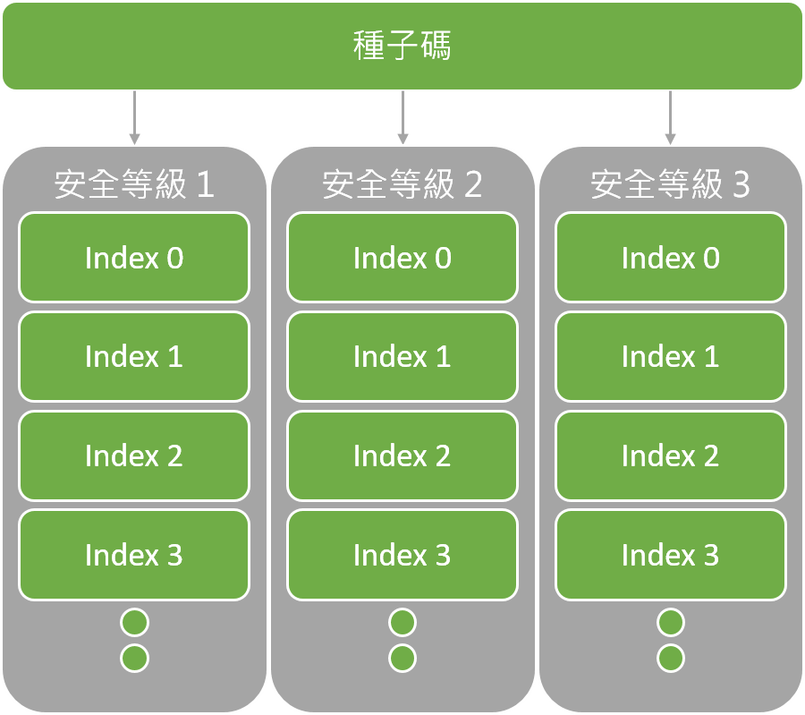
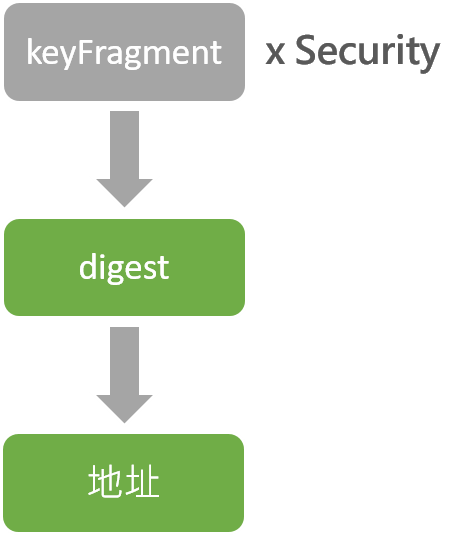
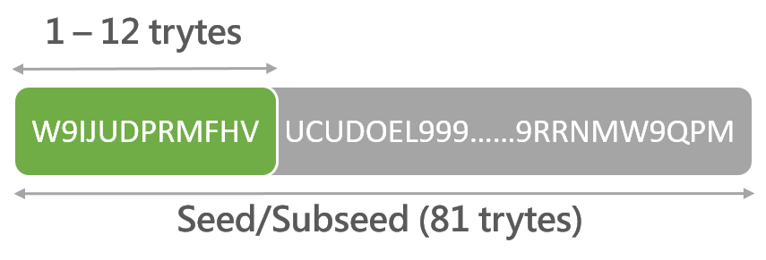

# 私鑰與地址

關於私鑰與地址等等之間的關係已經在[簽章過程](wots/wots.md)中提及，本文將會介紹的是私鑰與地址等等的格式與產生方式。所有的私鑰、Digest到地址都是從種子開始產生的，以下將會用 Javascript Library 作為舉例。

## 私鑰

首先要先瞭解的是每把私鑰都會對應一個地址，可以將此視為公鑰與私鑰的 Pair。鑰匙的 index 從 0 開始算起，最多可以到 $$2^{53}-1$$ 也就是總共可以有 9,007,199,254,740,991 個 index，此數值符合 IEEE 754-2008 的最大有效位數。index 數值會先從十進位轉換成 trits 後與種子相加產生 subseed。

再來 IOTA 一共有三種安全等級，這會決定雜湊時的次數，等於會影響之後產生鑰匙的長度大小。也就是說一個種子會有三個帳戶，給予相同的 index 所產生出來的私鑰也會不相同。官方錢包預設的安全等級為 2 而且是無法更改的，如果自己以其他方式使用等級 1 和 3 的話，這些交易紀錄不會顯示在官方錢包中。

## Digest

Digest 是私鑰轉換到地址的過程，如同上一篇文章所述，私鑰會先再 Hash 過 26 次才繼續產生 digest，我們將此雜湊過的私鑰稱為 keyFragment。而安全等級會決定 KeyFragment 的數量，姐就是說等級 3 的會就會將私鑰切為三個 keyFragment。每個 keyFragment 再進行 Hash 一次就會產生 digest，最後再將 digest 進行 Hash 一次就會產生地址。

## 地址

前面有提到鑰匙 index 會加到種子產生 subseed，而產生的 subseed 長度是不變的，只有前 1 到 12 trytes 會不一樣：

如果有人的種子後面 69 trytes 和自己的種子一樣的話，那麼他們就可能有機會看到你的錢包餘額。這邊可以算一下其他人末 69 trytes 一樣的機率會是 $$27^{69}$$ = 5.80x$$10^{98}$$，相較於比特幣的私鑰是 256 bits 總共組合會有 $$2^{256}$$ = 1.15x$$10^{77}$$，相比之下仍然比較安全。

## 地址檢驗碼

地址檢驗碼（checksum）會再加入 9 trytes 到原先有 81 trytes 的地址後面，用來檢驗地址完整性與是否有效。包含檢驗碼的地址總共會是 90 trytes。IOTA 官方錢包產生的地址永遠會包含檢驗碼，在產生交易時輸入的地址也一定要有檢驗碼。

產生檢驗碼的方式和最終產生地址類似，不過這次是將 81 trytes 的地址轉換成 trits 後一樣用 Kerl Hash 過一次後，再將產生出來的 243 trits 轉換回 tryte，取最後末 9 trytes 就是所需的檢驗碼，將此檢驗碼塞入原先地址最後面就會產生 90 trytes 包含檢驗碼的地址了。
