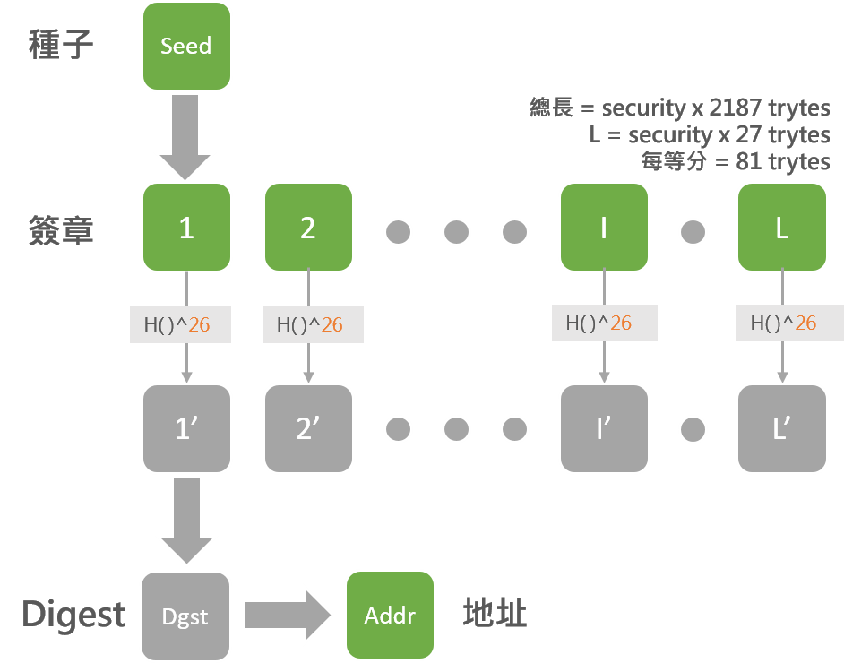
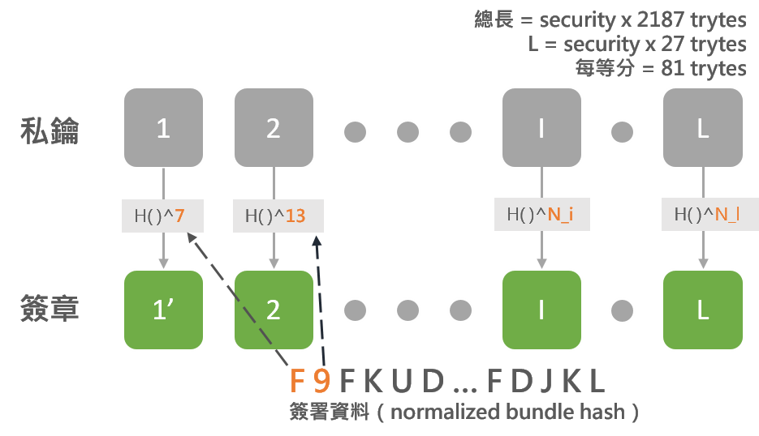
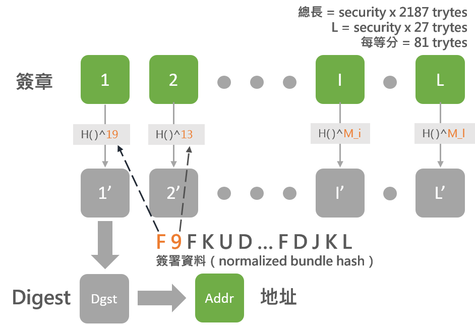
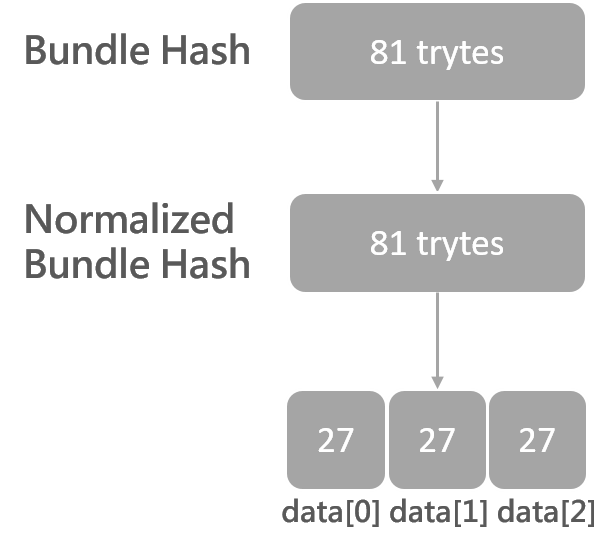

# IOTA 中的簽章過程

## Curl and Kerl

[https://github.com/iotaledger/kerl](https://github.com/iotaledger/kerl)

## 產生地址

 先用種子依照安全等級（security level）產生私鑰，安全的等級分為三種，1 為最簡單、2 為官方錢包使用的等級、3 為交易所使用的等級，接下來的步驟大致上如下：

* 備妥私鑰
* 將私鑰分成「L」等分， `L = security * 27`
* 將所有等分都 Hash 過，此過程稱為 `digest`
* Hash `digest` 兩次，此過程稱為 `address`




簡單來說就是 seed>private key>digest>address

## 簽章

簽章會用私鑰來簽署 tangle 上屬於你的資訊（簽署資料像是  bundle），tryte 對照的部分會用到 [IOTA 字母系統](ternery.md)

* 備妥私鑰
* 將私鑰分成「L」等分， `L = security * 27`
* 將第 *i* 等分 hash N_*i* 次， N_*i* 由以下方式算出：
> **如何算出 N_*i***
>
> 用簽署資料（Signed Data）中的第 *i* 個 tryte取得十進位數 'd'，像是 9 對應 `d=0`、[A] 對應 `d=1`。
>
> 公式： *N_i = 13 - d*
* 這些 hash 過的部分就統稱為**簽章**



## 驗證 (重新產生地址)

* 備妥私鑰
* 將私鑰分成「L」等分， `L = security * 27`
*  將第 *i* 等分 hash M_*i* 次， M_*i* 由以下方式算出：
> **如何算出 M_*i*** （基本上與 N 相同）
>
> 用簽署資料（Signed Data）中的第 *i* 個 tryte取得十進位數 'd'，像是 9 對應 `d=0`、[A] 對應 `d=1`。
>
> 公式： *M_i = 13 + d*
* 將所有等分一起 Hash 後產生 `digest`
* 將 `digest` Hash 兩次
* 檢查上一步產生的地址是否與簽署資料（通常指 Bundle）上的地址相同



## 簽署資料
簽章用來簽署輸入的地址，然後會存在簽署過輸入的 bundle 當中。簽署資料的長度為 security * 2187 tryte，存在 `signatureFragment` 中。`signatureFragment` 的大小為 2187 tryte，所以安全性越高，bundle 中所需的交易數量也越多。

上述簽章數據指的是包含簽章的 bundle hash (81 tryte)，更嚴謹的方式來說應稱作 `normalized bundle hash`，它會稍微增加 bundle hash 讓私鑰的曝光度保持在 50%。




normailized bundle hash 會再分成　data[0], data[1], data[2] 作為*簽署資料*，其中 27 trytes 用來算出對應的 27 個等分個別需 hash 幾次，以上的 data[i] 就是 27 trytes 的簽署資料。如果 `security = 1`，那就只有 data[0]；如果 `security = 2`，那就會需要 data[0] 和 data[1]，也就是總共有 54 trytes 做簽署。所以在產生 bundle 時，交易數量的多寡也和安全等級有關。等級越高所需要的 data[i] 也就越多。

雖然說用 API 會產生錯誤，但`security >= 4` 是能夠被協定允許的（像交易能夠受到確認）。不過因為沒有 data[3] 的關係，data[0] 會重複被使用。

## Normalized Bundle
```java:Bundle.java
/**
* Normalized the bundle.
* return the bundle each tryte is written in integer[-13~13]
**/
public int[] normalizedBundle(String bundleHash) {

    //  normalized Bundle 81 trytes.
    int[] normalizedBundle = new int[81];

    //  divides bundle hash into three sections, 27 trytes each.
    for (int i = 0; i < 3; i++) {

        long sum = 0;

        //  check each tryte in a section.
        //  get corresponding integer [-13~13]. And add it to sum.
        for (int j = 0; j < 27; j++) {

            //  sum += value, where
            //  value = integer value of i*27+j-th tryte
            sum +=
                (normalizedBundle[i * 27 + j] =

                    //  Convert tryte[9ABC...Z] into [-13~13]
                    Converter.value(Converter.tritsString("" + bundleHash.charAt(i * 27 + j)))
                );
        }

        // if sum of the section >= 0
        if (sum >= 0) {

            //  until sum = 0
            while (sum-- > 0) {

                //  decrement tryte
                for (int j = 0; j < 27; j++) {
                    if (normalizedBundle[i * 27 + j] > -13) {
                        normalizedBundle[i * 27 + j]--;
                        break;
                    }
                }
            }

        //  if sum of the section < 0
        } else {

            //  until sum = 0
            while (sum++ < 0) {

                //    increment tryte
                for (int j = 0; j < 27; j++) {

                    if (normalizedBundle[i * 27 + j] < 13) {
                        normalizedBundle[i * 27 + j]++;
                        break;
                    }
                }
            }
        }
    }

    return normalizedBundle;
}
```

## 地址重複使用的風險
回想上面計算 hash 次數的方式：

> **如何算出 N_*i***
>
> 用簽署資料（Signed Data）中的第 *i* 個 tryte取得十進位數 'd'，像是 9 對應 `d=0`、[A] 對應 `d=1`。
>
> 公式： *N_i = 13 - d*

hash 的次數與簽署資料的第 i 個 tryte 有關，如果簽署資料包含非常多 'M' 的話，就意味著幾乎不會做任何 hash，這會導致私鑰完全被曝光的風險。

## 抵抗量子計算
此簽章機制源自於 Winternitz one-time signature，WOTS 可以[抵擋量子計算的攻擊](https://eprint.iacr.org/2011/191.pdf)。


## Reference
* [https://github.com/iotaledger](https://github.com/iotaledger)
* [signing.js](https://github.com/iotaledger/iota.lib.js/blob/master/lib/crypto/signing/signing.js)
* [bundle.js](https://github.com/iotaledger/iota.lib.js/blob/master/lib/crypto/bundle/bundle.js)
